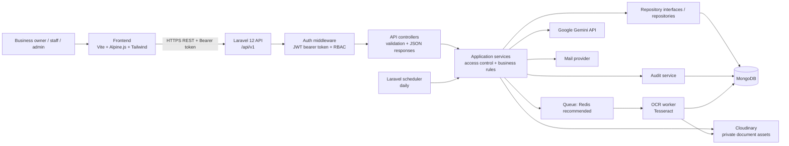
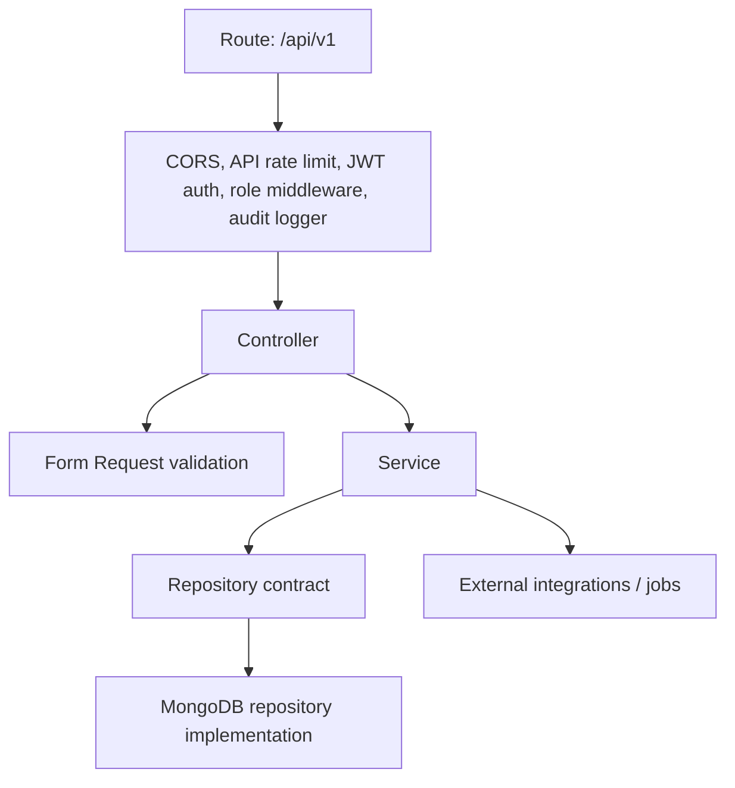
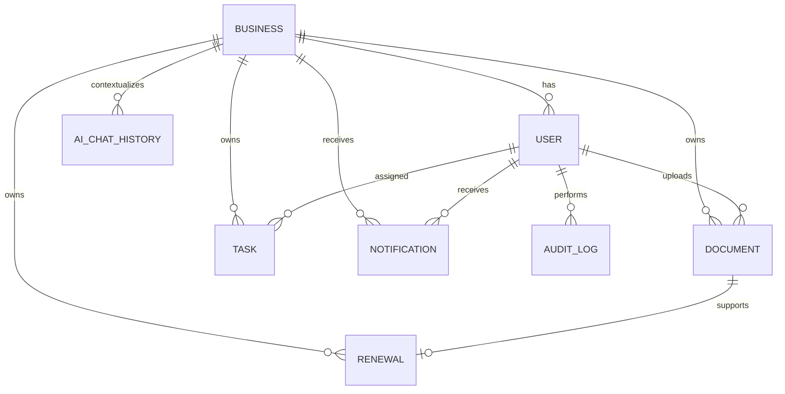
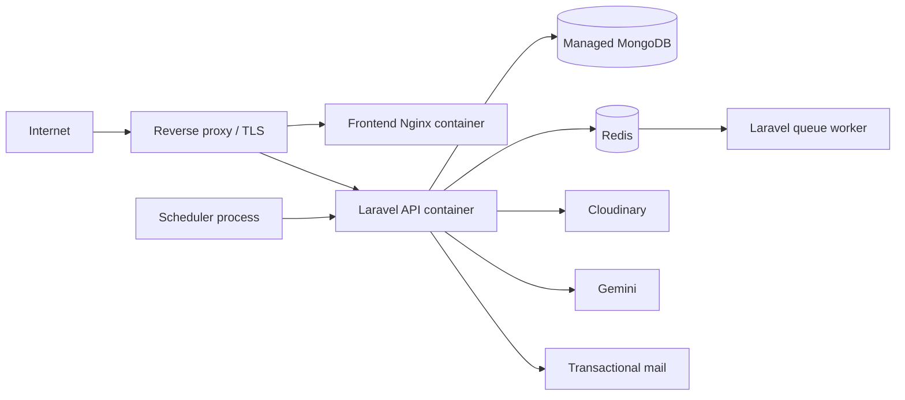

# ComplySmart System Architecture

ComplySmart is a multi-tenant compliance-management platform for Sri Lankan SMEs. Each authenticated user belongs to one business. All business records are scoped by `business_id`, so a user can only work with that business's documents, tasks, renewals, notifications, and AI history.

## 1. End-to-end architecture



The frontend calls the API through `frontend/src/js/api.js`; it does not access MongoDB, Cloudinary, Gemini, or mail providers directly. This keeps secrets and authorization decisions on the server.

## 2. Frontend architecture

The frontend is a Vite multi-page web application, using Alpine.js for page state and Tailwind CSS for styling.

| Area | Pages | API responsibility |
| --- | --- | --- |
| Public access | `index.html`, `register.html`, `login.html` | registration and login |
| Business workspace | `dashboard.html`, `profile.html` | business profile and compliance score |
| Compliance records | `documents*.html`, `tasks.html`, `renewals.html` | document vault, OCR status, tasks, renewal dates |
| Guidance and oversight | `ai.html`, `reports.html`, `notifications.html` | AI assistance, reporting, audit visibility, alerts |

`api.js` is the single HTTP client. It reads `VITE_API_URL` (normally `/api/v1` in development), attaches `Authorization: Bearer <token>`, serializes JSON or `FormData`, and normalizes HTTP/network results. The access token, current user, business, and theme preference are presently stored in browser `localStorage`.

### Recommended frontend organization as the app grows

```text
frontend/src/
  js/api.js                 # transport only
  js/auth.js                # login, token lifecycle, route guard
  js/features/
    documents.js
    tasks.js
    renewals.js
    reports.js
    ai.js
  js/components/            # shared navigation, modal, table, form state
  styles/                   # Tailwind entry/custom styles
```

## 3. Backend architecture



The Laravel backend follows a layered design:

- **Routes/controllers** expose versioned REST resources and return JSON.
- **Form requests** validate inputs before business logic runs.
- **Services** own authorization and workflows: `AuthService`, `BusinessService`, `DocumentService`, `TaskService`, `RenewalService`, `NotificationService`, `ReportService`, `AuditService`, and `AIChatService`.
- **Repositories** isolate MongoDB access behind interfaces, which makes services easier to test and lets storage be replaced later.
- **Middleware** handles CORS, API/AI/login throttling, bearer-token authentication, role checks, and audit capture.
- **Jobs and commands** handle work that should not block a browser request.

### API modules

| Module | Base endpoint | Main purpose |
| --- | --- | --- |
| Health | `GET /api/v1/ping` | availability check |
| Auth | `/api/v1/auth/*` | registration, login, logout, current user |
| Business | `/api/v1/business`, `/businesses` | business profile and administration |
| Documents | `/api/v1/documents` | upload, metadata, secure ownership checks, OCR status |
| Tasks | `/api/v1/tasks` | compliance task lifecycle |
| Renewals | `/api/v1/renewals` | licence/permit deadlines and upcoming items |
| Notifications | `/api/v1/notifications` | unread feed and read-state changes |
| AI | `/api/v1/ai/*` | chat, checklist generation, OCR-text summarization |
| Reports | `/api/v1/reports/*` | overview and admin audit reporting |

All non-auth resources require `auth:api`. Admin-only audit reporting also requires `role:admin`. Keep all new tenant data endpoints scoped through the authenticated user's `business_id`; never trust a business ID supplied by the browser without verifying membership.

## 4. Data architecture

MongoDB stores application records. Relationships are represented by IDs rather than relational joins.



| Collection | Important fields |
| --- | --- |
| `users` | name, email, password hash, role, `business_id` |
| `businesses` | owner, type, registration data, contact data, compliance score |
| `documents` | `business_id`, Cloudinary IDs/URL, metadata, expiry date, OCR state/text |
| `tasks` | `business_id`, title, assignee, due date, status |
| `renewals` | `business_id`, optional `document_id`, due date, reminder state, status |
| `notifications` | user/business scope, type, content, `read_at` |
| `audit_logs` | actor, action, entity, changed values, IP address |
| `ai_chat_history` | user/business scope, role, message |

Use MongoDB indexes for high-frequency filters: `users.email` (unique), `users.business_id`, every business-scoped collection's `business_id`, `documents` compound search/status paths, `tasks.due_date`, `renewals.due_date + reminder_sent_at`, and `notifications.user_id + read_at`.

## 5. Critical workflows

### Authentication

1. The user registers or logs in through the frontend.
2. Laravel validates credentials and returns a JWT bearer token plus user/business context.
3. The client stores the token and sends it with protected API calls.
4. `auth:api` resolves the user; services enforce tenant ownership and roles.
5. Logout invalidates the server-side token and clears browser state.

### Document upload and OCR

1. The client submits multipart form data to `POST /documents`.
2. Laravel validates type and size, verifies the user's business, uploads the binary to Cloudinary, and saves document metadata in MongoDB.
3. Supported image/PDF documents create an `ExtractOcrTextJob` and begin as `pending`.
4. A worker downloads the protected asset, runs Tesseract, then sets OCR status to `done` or `failed` and saves the text/error.
5. The browser polls `/documents/{id}/ocr-status` until completion.

### Reminders and notifications

1. Laravel Scheduler runs `complysmart:send-reminders` daily at 08:00 and an overdue-task pass at 00:05.
2. The command marks overdue tasks, finds upcoming renewals, creates in-app notifications, sends owner email, and stamps `reminder_sent_at` to prevent duplicates.

### AI guidance

1. An authenticated user submits a question, checklist request, or document summary request.
2. `AIChatService` supplies business/compliance context, calls Google Gemini from the backend, and stores chat history under the user and business.
3. AI routes are limited to 20 requests per minute per user. Outputs must be presented as guidance, not legal advice.

## 6. Deployment topology

The supplied Docker Compose configuration currently runs frontend Nginx, backend PHP-FPM/Nginx, and MongoDB. For a reliable production deployment, add Redis and separate long-running processes:



Run one scheduler process (`php artisan schedule:work` or a platform cron invoking `schedule:run`), one or more queue workers (`php artisan queue:work --tries=3 --timeout=120`), and the API independently. Redis should be the production queue/cache driver; MongoDB remains the system of record. Do not run OCR inside the web request process.

## 7. Security and operational baseline

- Use HTTPS, environment-managed secrets, and separate development/staging/production credentials.
- Keep Cloudinary assets private or use short-lived signed URLs for document viewing; do not expose permanent public links for sensitive compliance records.
- Retain server-side authorization checks for every document, task, renewal, and report—not only UI route guards.
- Keep access tokens short-lived and prefer an HTTP-only refresh-token/session strategy over long-lived tokens in `localStorage` for a higher-security production release.
- Enable MongoDB backups, Cloudinary retention policy, queue retry/failed-job alerts, API error monitoring, and structured audit-log retention.
- Remove `withoutVerifying()` from outbound Gemini HTTP calls in production so TLS certificates are validated.
- Restrict CORS to the actual frontend origin, set upload limits, scan uploads where required, and redact sensitive fields from logs/audit deltas.

## 8. Environment contract

Frontend:

```env
VITE_API_URL=/api/v1
```

Backend requires at minimum:

```env
APP_ENV=production
APP_KEY=...
APP_URL=https://api.example.com
MONGODB_URI=...
MONGODB_DATABASE=complysmart
QUEUE_CONNECTION=redis
CACHE_STORE=redis
REDIS_URL=...
CLOUDINARY_URL=...
GEMINI_API_KEY=...
MAIL_MAILER=...
```

This architecture gives one clear ownership boundary: the frontend renders and requests; Laravel authorizes and orchestrates; MongoDB stores domain data; workers/schedulers process long-running and time-based work; external providers supply storage, AI, and delivery.
